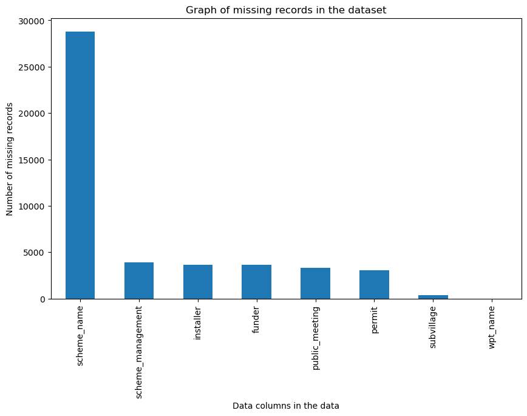
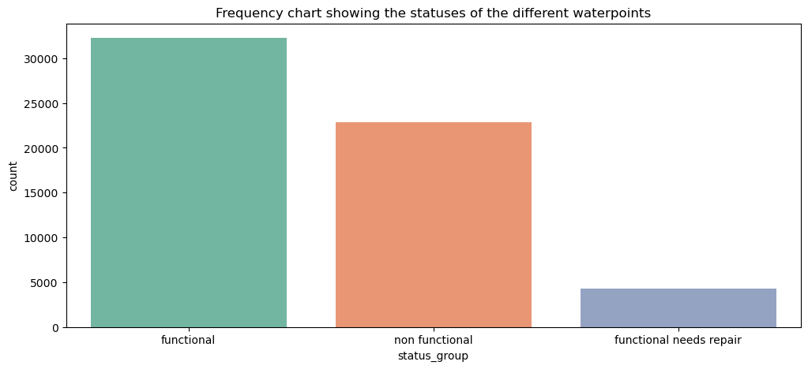
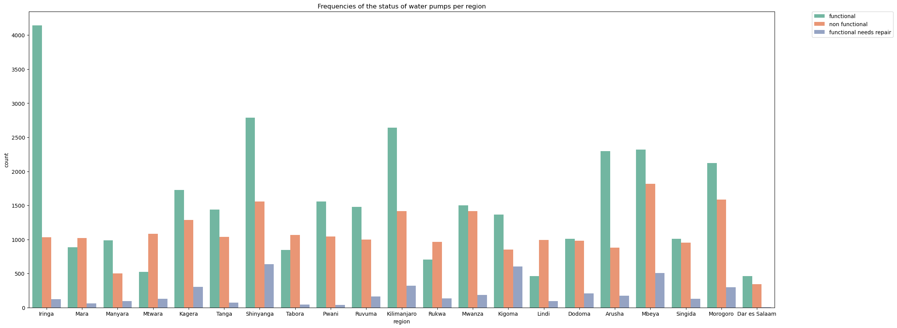
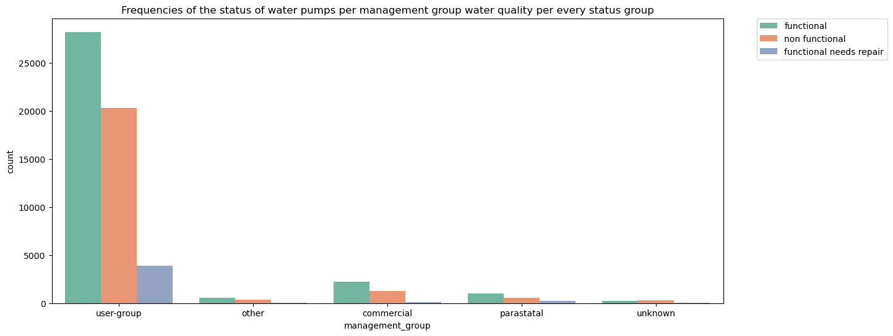

# Tanzania Water Point Classification System

## Introduction
Access to water and sanitation are recognized as human rights by the United Nations. The right to water entitles everyone to access sufficient, safe, acceptable, physically accessible, and affordable water for personal and domestic use. Access to clean water opens lots of possibilities in a community and improves the quality of life and standards of living of a people. Access to clean water enables for proper development of adults, children, and livestock and thus increases their survival rate. Access to clean water also improves the sanitation efforts of a community and this in turn helps lower infection and disease rates of a people. In addition, access to clean water affords a community a chance to boost their economic output since they are more capable of growing crops and rearing livestock and they can start manufacturing and processing industries which most rely on the availability of water. As we have seen from the cases above water is a vital necessity. However, billions of people across the world are still living without safely managed water and sanitation.

Third-world countries account for the huge percentage of people who do not have access to water. The United Nations estimates that around one billion people in developing countries have inadequate access or lack access to clean and reliable water sources. As of October 2022, about 226 million people in Eastern and Southern Africa did not have access to basic water services. The situation is worse in rural areas than in cities. Nine countries (Angola, Democratic Republic of Congo, Ethiopia, Kenya, Madagascar, Mozambique, Sudan, Tanzania, and Uganda) are home to 80% of underserved people in the region.

In Tanzania, for instance out of its population of 65 million people, 58 million people (88% of the population) lack access to safe water, and 49 million people (74%) lack access to a safe toilet. This greatly affects the quality of life of the people since they have to travel great distances to get access to clean water. The national government of Tanzania is aware of these troubling metrics and is working to make clean water more available. The national government of Tanzania through the Tanzania Ministry of Water has set bold and ambitious plans to double clean water accessibility in the next 10 years. It is working together with international organizations such as the United Nations, the World Bank, and the International Monetary Fund and is more than willing to engage with Non-Governmental Organizations.

Addressing people’s need for water and sanitation is vital in improving economic growth and more importantly, improving the lives and health of people and it ensures that their most vital and basic human rights are met. To address these challenges, we need to unite, come up with innovative solutions, and work together to make the lives of other people better. 

## Problem Statement
Dutch Water Limited (DWL) is a world-leading organization that produces and sells affordable, healthy, and purified water to all people. They are experts in water purification and making water accessible to many people. They are partnered with 2 European companies whose expertise is making water pumps and filtration systems. They have looked at current United Nations studies and have visited the country (Tanzania) and they feel like they can make a considerable effort in alleviating some of the water accessibility crisis felt in Tanzania. 

They have engaged the national government of Tanzania through the Tanzania Ministry of Water and they have decided to help the government and its citizens by repairing the waterpoints throughout the country. This is in line with their expertise and that of their partners. The ministry has provided data on all the water points with many different metrics but it is incomplete. 

DWL needs to come up with a relevant strategy to analyze the data and use it to help them predict the functioning status of the waterpoints to maximize their efforts ensure efficiency and ensure they can do the most.

## Objectives

### Main Objective
To analyze the various data that have been made available to them by the Ministry of Water in Tanzania and come up with a machine learning model that can predict the functioning status of a waterpoint given certain factors.

### Specific Objectives
To gain insight into the various operating states of the waterpoints throughout the country and their frequencies.

To gain a greater insight into the water points throughout the various regions of the country. This is to understand which regions need the most attention so that they can be given higher priority.

To gain a better understanding of how the water points are managed come up with strategies on how to guide the maintenance of the waterpoints.

To gain the operating environments of the waterpoints. This mainly includes the state or condition of the water at the water points. To decide which technology or type of pumps to bring in and use.

## Notebook Structure
Reading the data

Data Wrangling and Cleaning

Exploratory Data Analysis

Modelling

Conclusions

Recommendations

## Data Understanding
The data used in this project was aquired from Tanzania Ministry of Water and Taarifa which is the leading provider of business management solutions and online data storage for businesses in Tanzania. It contains various data and information on the water points and the environment which they operate in and status of whether they are functional, non functional or functional but needs repair.

The entire data used in the project is contained in 2 datasets. The datasets contain the following features:

amount_tsh - Total static head (amount water available to waterpoint)

date_recorded - The date the row was entered

funder - Who funded the well

gps_height - Altitude of the well

installer - Organization that installed the well

longitude - GPS coordinate

latitude - GPS coordinate

wpt_name - Name of the waterpoint if there is one

num_private - Indicates whetherthe well is private

basin - Geographic water basin

subvillage - Geographic location

region - Geographic location

region_code - Geographic location (coded)

district_code - Geographic location (coded)

lga - Geographic location

ward - Geographic location

population - Population around the well

public_meeting - True/False

recorded_by - Group entering this row of data

scheme_management - Who operates the waterpoint

scheme_name - Who operates the waterpoint

permit - If the waterpoint is permitted

construction_year - Year the waterpoint was constructed

extraction_type - The kind of extraction the waterpoint uses

extraction_type_group - The kind of extraction the waterpoint uses

extraction_type_class - The kind of extraction the waterpoint uses

management - How the waterpoint is managed

management_group - How the waterpoint is managed

payment - What the water costs

payment_type - What the water costs

water_quality - The quality of the water

quality_group - The quality of the water

quantity - The quantity of water

quantity_group - The quantity of water

source - The source of the water

source_type - The source of the water

source_class - The source of the water

waterpoint_type - The kind of waterpoint

waterpoint_type_group - The kind of waterpoint

status_group - (target variable) contains information on whether the water point is functional, non functional and functional needs repair.

## Methodology

### Combining Data Sets
This is where the 2 different data sets are going to be combined or merged to form 1 big data set that is going to be used for the rest of the project.

### Data Wrangling and Cleaning
In this section data is manipulated to ensure that it can be used in the later stages of the process. The later stages are Exploratory Data Analysis and Modelling.

#### Dealing with null values
The image below show the number of missing records or null records in the data frame.

In this case, majority of the null values belong to object data type. The null values were replaced by the term "other"
There were also missing boolean values. These were replaced by either True or False depending on a logical criteria.

#### Dealing with 0s in numerical data types
The data contained 0s in terms of values. Replacing them or dealing with them depended solely on the interpretation or the nature of the information represented. For instance a 0 in construction_year needs to be dealt with because the corresponding water point does exist and has an id and a status_group variable assigned to it. 0s are replaced with either the mean or the median value of the column

#### Feature engineering
In this section the feature operational_year was created in order to find out how many years a certain water point has been in operation

#### Dropping of features
In this section, duplicate data features were deleted from the data set. This is because information these features represent already exists in the dataset

### Exploratory Data Analysis
Here we visualize the cleaned data to gain more information about the data we are using and we see whether we can answer or meet our objectives.

From the chart below we can see that the various distribution of the statuses of the waterpoints. As we can see, the number of functional pumps at the waterpoints is more than the non functional and the functional but needs repair category. The functional needs repair category is the least. This means that a pump at a water point is much more likely to non functional incase of a malfunction that it is to keep on working with damage. It could also be as a result of the damages that the waterpoints get are more serious and renders them unable to work.

The figure below shows the frequencies and the statuses of the water pumps in each region in the country. Here we can see the statuses of the various water pumps across the region and this can enable us to see which areas are in dire need of help in fixing the water pumps. This can also tell us which ares may be having water shortages. 

In the regions of Mara, Mtwara, Tabora, Rukwa and Lindi, there may be a water accessibility problem. This is because there are more water pumps and waterpoints that are not functioning as compared to those that are functioning. This means that there may be water scarcity or water may not be easy to find. This means that incase there is going to be a huge initiative to fix the water pumps these areas should be given more priority since there may be a scarcity or difficulty in accessing water.

How the pump is managed plays a huge role in how long it is able to function and this inturn affects the populations water accessibility. The figure above gives us a breakdown of various management groups of the pumps and the waterpoint throughout the country. 

From the figure below we can see that the user group management is the most popular. This represents the category of water pumps or water points that are solely managed by the community or the population that is around it and uses it the most. This represents 52490 amount of pumps. The statuses of the pumps and the water points follow the general trend that is experienced throughout the dataset but there is an unusually high number of non-functional water pumps although there are still less than the functional ones. This could point to inneficient management or lack of maintenance by the population or the user-groups incharge of the water pumps.

The next sets of management groups are less compared to the majority user-group. These do no have more than 4,000 water pumps each with 2 having less than 1000 water pumps and waterpoints.

From the figure below we can see the frequency values of various water quality metrics and the statuses of the pumps. We can see that majority of the pumps operate in areas with soft water, which is the most ideal. In the soft water quality, the pump status category is in line with the frequency distribution plot. This means that functional pumps are the most and functional needs repair are the least.

For salty and unkown water quality conditions however, the number of non functional water pumps however are more. This could either be because of the pumps being unable to handle the nature of water or the nature of water makes the pumps less reliable. One of the main reasons is that salt water is very corrosive and affects the metals in the pumps and the seals. This makes them unreliable or require more maintenance

### Modelling

In this section we did some pre pocessing activities in order to get the data ready for modelling. This activities included:
 - Converting the target variable from text categorical into numerical categorical in order to help in model training and prediction.

 - Converting the predictors in object data type into numerical category so as to aid in model training and prediction.

 - Ran our data set through SMOTE to ensure that our model does not have a class imbalance problem during training which would have affected the results.

 - Split our data into training and testing.

 We then ran tried our data with numerous classification algorithms and kept track of the accuracy and f1 score metrics. XGBoost Classifier algorithm performed better than the rest and thats what we used in the model.

 We then created the baseline model and used GridSearchCv to come up with the most optimum parameter 
 
 The final XGBoost Classifier was built with the optimum parameters after performing GridSearch and the final model accuracy was at 85%.

### Conclusion
Some of our takeaways from the project are:

 - Most of the water points are communal standpipes and they service a huge population of people. This means that they are highly depended upon and incase they are damaged or fail to work it impacts a huge population in the community.

 - Most of the water points service the population with soft and clean water. This means that the consumption and use of the water is direct and no additional steps or actions need to be taken in order to make it usable.

 - Salty water makes up for the second highest water quality in use by the population. This means that in order to repair these water points, pumps that deal with salty water need to be acquired.

 - A majority of the water poins are managed by the user group and in this case it is the community. This ensures that all people in the community can have easy access to the water point and in an indisciminately manner.

 - The regions of Mara, Mtwara, Tabora, Rukwa and Lindi have the biggest water accessibility problem. This is due to the number of non functioning water points are more than the functioning water points.

 - For our prediction problem, XGBoost Classifier algorithm proved to be the best since it had the highest accuracy and f1 score.

 - The final model after hyperparameter tuning produced results with an accuracy level of 85%

### Recommendations
The following are our recommendations regarding the implementation of the model, where to improve it and in the massive exercise to repair the water points:

 - In order to improve the accuracy of the system we recommend acquiring more complete and accurate data. This will enable for better training of the model which would lead to higher accuracy level than the 85%

 - DWL should place greater attention and emphasis in their efforts to repair water points in the regions of Mara, Mtwara, Tabora, Rukwa and Lindi. This is because they have more non functioning water points than functioning ones.

 - For this massive exercise, DWL should consider using submersible ground water pumps since they are made with stainless steel and can handle a wide variety of conditions. They should get the best of these from either Honda or Grundfos

 - DWL should invest in a community program to teach the community living near the water point on suitable ways they can maintain and better take care of the waterpoints.